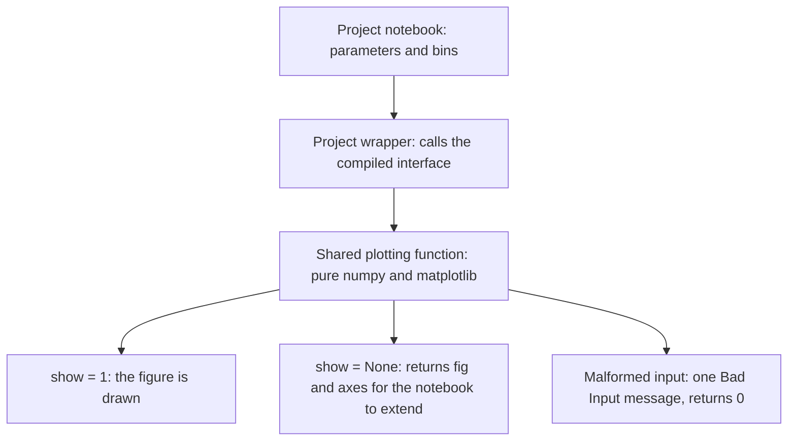
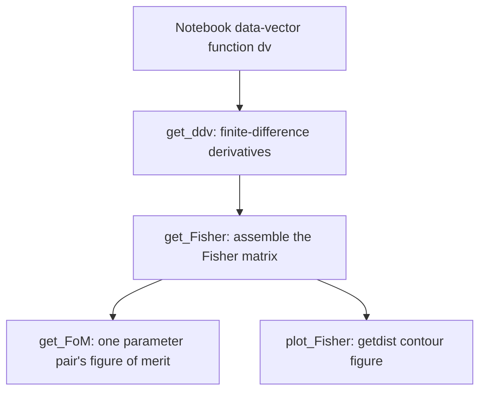

# Table of contents

1. [What this package provides](#overview)
2. [Using the package from a notebook](#usage)
3. [The modules](#modules)
4. [Design rules every module follows](#design)
5. [The plotting conventions](#plotting)
6. [CAMB input and Fisher forecasts](#fisher)
7. [Units and array conventions](#units)
8. [The covariance subpackage](#covariance)
9. [Appendix](#appendix)
   1. [How do I plot a quantity for a new probe?](#new_probe)
   2. [Why do the Fisher helpers take my function as an argument?](#why_dv)
   3. [Why is one panel empty and marked "excluded"?](#excluded)
   4. [Where do fonts and figure styles belong?](#styles)
   5. [How do I check that a figure is right?](#check_figures)

# What this package provides <a name="overview"></a>

Every Cosmolike project ships `EXAMPLE_EVALUATE*.ipynb` notebooks that
drive its compiled interface directly: they run CAMB, call
`set_cosmology` and the nuisance setters, and inspect data vectors,
spectra and covariances. The calculations and figures that do not
depend on one project live here, once. A private copy in each notebook
would drift, and every interface change would have to be repeated in
each project.

The package serves a reader who knows the physics (tomographic
two-point functions, Fisher forecasts, covariance matrices) and wants
to inspect a project's predictions interactively. The
[data-vector guide](../cosmolike/README.md) explains the C calculation
that produces the quantities plotted here; the
[covariance physics guide](../cosmolike/covariances/README.md) explains
the covariance components.

# Using the package from a notebook <a name="usage"></a>

We assume Cocoa and one project (LSST Y1 below) are installed, users
have run `conda activate cocoa`, and Bash is open in `cocoa/Cocoa`.

**Step :one:**: activate Cocoa's environment and compile the project.

```bash
source start_cocoa.sh
unset IGNORE_COSMOLIKE_LSST_Y1_CODE
source ./projects/lsst_y1/scripts/compile_lsst_y1.sh
```

**Step :two:**: start Jupyter and open a project notebook.

```bash
jupyter lab --no-browser
```

**Step :three:**: inside the notebook, import the package.

```python
sys.path.insert(0, os.environ['ROOTDIR']
                + '/external_modules/code/cosmolike_core')
import cosmolike_notebook_utils as cnu
```

`import cosmolike_notebook_utils as cnu` binds the CAMB helper, the
galaxy/shear plotters and the Fisher tools. Three module groups are
deliberately not bound by that line and are imported explicitly where
they are used:

```python
from cosmolike_notebook_utils import plot_datavectors_cluster as pdc
from cosmolike_notebook_utils import covariance as cov
from cosmolike_notebook_utils import plot_covariances as pcov
```

The cluster plotters stay separate because only cluster projects need
them; the covariance modules stay separate because covariance
generation is optional at compilation and its notebooks follow their
[own guide](covariance/README.md).

How one figure is produced, from a notebook to the screen:



# The modules <a name="modules"></a>

| Module | What it supplies |
| --- | --- |
| [camb_cosmology.py](camb_cosmology.py) | `get_camb_cosmology`: one CAMB run packaged into the tuple `set_cosmology` consumes, on the nested grids the likelihoods use. |
| [plot_datavectors.py](plot_datavectors.py) | Tomographic panel grids of the galaxy/shear data vectors: `plot_C_ss_tomo_limber`, `plot_xi`, `plot_C_gs_tomo_limber`, `plot_gammat_tomo_limber`, `plot_C_gg_tomo`, `plot_wtheta_tomo`, and the baryonic-feedback sweep `plot_baryon_suppression`. |
| [plot_datavectors_cluster.py](plot_datavectors_cluster.py) | The cluster observables: `plot_N_cluster` counts, cluster lensing (`plot_gammat_cluster_tomo`, `plot_sigma_cluster_tomo`, `plot_C_cs_tomo_limber`), cluster clustering and cluster x galaxy, in the same panel conventions. |
| [plot_response.py](plot_response.py) | `plot_response_function`: how each data-vector entry responds to the matter power spectrum, as d ln DV / d ln k curves and cumulative R(k_max). |
| [fisher.py](fisher.py) | Finite-difference and derivkit derivatives of a supplied data-vector function (`get_ddv`, `get_ddv_dkit`), Fisher assembly (`get_Fisher`, `get_Fisher2`), `get_FoM`, Gaussian priors and getdist contour plots (`plot_Fisher`). |
| [plot_covariances.py](plot_covariances.py) | Covariance figures from supplied arrays: split correlation triangles, component maps and histograms, and standard deviations per angular or multipole bin. |
| [covariance/](covariance/README.md) | Preparation and assembly of Gaussian, super-sample and connected non-Gaussian covariance forecasts, with accuracy controls, eigenvalue diagnostics and independent test oracles. |

Each module's docstrings carry the complete argument lists, shapes and
units; `help(cnu.plot_xi)` in a notebook prints them.

# Design rules every module follows <a name="design"></a>

- **The package never imports a project's compiled interface**
  (`cosmolike_<project>_interface`). Each project compiles its own
  module, so importing one here would bind the package to whichever
  project a notebook loaded first. A function that needs cosmolike
  receives the notebook's callable as an argument instead: the `dv`
  and `ddv` parameters of the Fisher helpers, and the `interface`
  argument of the covariance assembly.
- **The plotting modules are pure numpy and matplotlib.** They never
  call CAMB or compiled code, so every project shares them unchanged
  and they run without a compiled interface.
- **Cluster code lives in files whose names end in `_cluster`**, as in
  the C core. The galaxy modules and this package's `__init__.py` do
  not import it; notebooks import it explicitly.
- **Project facts stay in the project**: fiducial values, bin layouts
  and the interface init sequence live in each project's notebooks and
  in `projects/<name>/interface/cosmolike_<name>_notebook_wrappers.py`,
  which binds them to the shared functions here.
- **Figures are evidence, not decoration.** A plotting function never
  alters the quantity it draws: masking an undefined ratio is
  display-only, and no covariance is repaired to look positive.

# The plotting conventions <a name="plotting"></a>

The `plot_datavectors` family shares one behavior, so figures of
different probes look alike and notebooks can swap them:

- **One panel per tomographic bin or bin pair.** Cosmic shear is a
  lower triangle, galaxy-galaxy lensing a source-row by lens-column
  grid, clustering one row of auto panels. The panel label counts bins
  from 1; the arrays index them from 0, so the panel labeled (1,2)
  draws the slice `[:, 0, 1]`.
- **First arguments:** the list of curves (each entry what the project
  wrapper returns), then the optional reference, then `param` and
  `colorbarlabel` for a parameter sweep colored by one colorbar.
- **Without a reference** each panel shows the quantity itself with
  its own y-range (the real-space and spectrum plotters show the
  absolute value on a log axis); **with a reference** each panel shows
  value/reference - 1 on one shared linear band, with the panels glued
  edge to edge.
- **`rescale = 1`** glues the absolute panels instead: each panel is
  multiplied by its own power of ten, annotated inside as alpha.
- **`show = 1` draws the figure; `show = None` returns `(fig, axes)`**
  for the notebook to extend. Malformed input prints one `Bad Input`
  message naming the problem and returns 0 instead of raising.
- **An extra bin index becomes curves inside a panel, not more
  panels**: the richness bins of the cluster blocks are line styles,
  with their own legend when more than one is drawn.
- **The functions do not save files and do not set fonts or styles**;
  see the [styles FAQ](#styles).

# CAMB input and Fisher forecasts <a name="fisher"></a>

`get_camb_cosmology(...)` runs CAMB once and returns the tuple that
`set_cosmology` consumes: log10 wavenumber grids, the linear and
nonlinear ln-power tables, distances and the growth table, on the same
nested grids the likelihoods build. Its `AccuracyBoost` knob follows
the likelihoods' split: the CAMB side receives the factor
`1 + (AccuracyBoost - 1)/3`, and the grid densities scale with the
boost. The growth factor is normalized at the end of the 2D redshift
grid, exactly as in the likelihoods, so notebook spectra and
likelihood spectra agree at the shared settings.



The Fisher helpers build forecasts from any function that maps a
parameter vector to a data vector:

```python
ddv = cnu.get_ddv(dv=my_datavector, index=0, CV=masked_inverse_cov)
fisher = cnu.get_Fisher(ddv=ddv, CV=masked_inverse_cov)
print(cnu.get_FoM(0, 1, fisher))
```

Here `my_datavector` is the notebook's own wrapper around the compiled
interface. `get_ddv` uses symmetric finite differences; `get_ddv_dkit`
uses the derivkit package; `get_Fisher2` combines both steps.
`plot_Fisher` draws getdist contours from one or two Fisher matrices.
The derivative step sizes and the figure-of-merit convention are
documented in [fisher.py](fisher.py)'s docstrings, including the
limits of each shortcut.

# Units and array conventions <a name="units"></a>

| Quantity | Convention |
| --- | --- |
| Angle | The plotters take and display theta in arcminutes; the C core integrates in radians, and the project wrappers convert. |
| Multipole | Integer ell. The shear plotter draws ell(ell+1) C_ell / 2 pi; the galaxy-galaxy lensing and clustering plotters draw C_ell itself. |
| Wavenumber | `get_camb_cosmology` hands the interface log10 k in 1/Mpc and shifts to h/Mpc where the tuple requires it; `plot_baryon_suppression` takes log10 k in 1/Mpc. |
| Power tables | Natural logarithm of P in (Mpc/h)^3, as the interface expects. |
| Bin index | Function arguments count bins from 0, as the arrays do; panel labels and legends count from 1. |
| Data-vector order | Panel-major: each probe's tomographic rows hold their angular bins or multipoles contiguously, matching the project's data files. |

The [data-vector guide's unit appendix](../cosmolike/README.md#units)
covers the core's internal c/H0 conventions, which matter when calling
the compiled interface directly.

# The covariance subpackage <a name="covariance"></a>

[covariance/](covariance/README.md) prepares survey inputs and
assembles complete Gaussian + SSC + cNG forecasts in real and Fourier
space, through the same C kernels the production command line uses.
Its guide documents the array conventions, the one `accuracy_boost`
knob and the independent `integration_accuracy` ladder, the eigenvalue
diagnostics, and the independent oracles that test the C components.
Covariance generation must be enabled at compilation
(`IGNORE_COSMOLIKE_<PROJECT>_COVARIANCE`); reading a supplied
likelihood covariance never requires it.

[plot_covariances.py](plot_covariances.py) draws the resulting
matrices: split correlation triangles comparing two matrices, G/SSC/cNG
component maps and histograms, and per-bin standard deviations. It
receives arrays only; every mask it applies is display-only.

# Appendix <a name="appendix"></a>

## How do I plot a quantity for a new probe? <a name="new_probe"></a>

Copy the conventions of the existing family rather than inventing a
layout: one function per probe and space, named `plot_<quantity>`; the
argument order, shared option set and return cases of
[the plotting conventions](#plotting); the glued-panel helpers of
`plot_datavectors.py`. Then render every mode (absolute, rescaled,
ratio, with data points, with an excluded panel) and look at the
images before trusting the function: overlapping tick labels and a
legend covering a curve are found by looking, not by tests.

## Why do the Fisher helpers take my function as an argument? <a name="why_dv"></a>

Because the package never imports a compiled interface, the notebook
owns the binding between cosmolike and the parameter vector. Passing
`dv` explicitly keeps that ownership visible, lets two projects use
the same helpers in one session, and avoids replacing module state at
run time, which these repositories prohibit.

## Why is one panel empty and marked "excluded"? <a name="excluded"></a>

A (lens, source) pair dropped by the project's `init_ggl_exclude`
arrives as an identically zero array. Drawing zeros on a log axis
would fail, and silently skipping the panel would hide the exclusion,
so the panel stays in the grid with an "excluded" placeholder.

## Where do fonts and figure styles belong? <a name="styles"></a>

In the notebook. The plotting functions accept explicit size options
(axis labels, tick labels, legends, bin labels) but never set global
matplotlib state, so a notebook's rcParams choices (for example
Cocoa's STIX/retina setup) apply to every figure uniformly.

## How do I check that a figure is right? <a name="check_figures"></a>

Plot a quantity against its own reference first: the ratio mode must
give exactly zero everywhere, and the glued band should sit at 1.
For covariances, `covariance.diagnostics.covariance_modes` reports the
correlation eigenvalues of the matrix a figure summarizes; a plot can
hide a negative mode that the eigenvalues expose. The project test
suites under `projects/<name>/tests/` remain the quantitative checks;
figures complement them.
